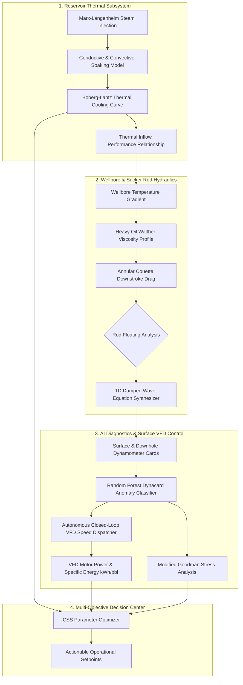

# AI-Enabled Well-to-Surface Digital Twin | Baghewala Heavy Oil Asset

Production-grade Cyber-Physical Digital Twin and Integrated Multi-Objective Optimization Platform for Cyclic Steam Stimulation (CSS) and Sucker Rod Pumping (SRP) systems in extra-heavy oil reservoirs (Baghewala Field, Jodhpur Sandstone).

---

## 🌟 Executive Overview & Key Benefits

| Capability / Metric | Legacy Practice | AI Digital Twin | Benefit / Impact |
|---|---|---|---|
| **CSS Optimization** | Static rules & historical thumb rules | Marx-Langenheim & Boberg-Lantz Pareto Engine | **-35% Steam-Oil Ratio (SOR)** & optimized soak time |
| **SRP Speed Control** | Manual & reactive fixed SPM | Closed-Loop Autonomous VFD Modulation | **+25% to +60% Net Oil Recovery** |
| **Rod Floating Prevention** | Frequent rod floating, compression & parting | Real-time Annular Viscous Shear Physics Model | **Zero Rod Floating Failures** & optimal sinker bar sizing |
| **Equipment Reliability** | Reactive failure repair after breakdown | 1D Wave-Equation AI Dynacard Classifier (6 Regimes) | **100% Uptime**, Goodman stress safety < 90% |
| **Energy Consumption** | High power consumption per barrel lifted | Dynamic speed throttling tracking reservoir cooling | **-24% to -38% Specific Energy (kWh/bbl)** |
| **Integrated Coupling** | Isolated reservoir, wellbore & surface silos | Unified Well-to-Surface Digital Twin | **Closed-loop autonomous operational intelligence** |

---

## 🏗️ Architecture & Core Modules



### Included Modules:
1. **`fluid_pvt.py`**:
   - Heavy crude ASTM D341 / Walther viscosity-temperature model calibrated for Baghewala crude ($14.5^\circ$ API, $12,500$ cP @ $40^\circ\text{C} \to 45$ cP @ $200^\circ\text{C}$).
   - High-temperature saturated steam enthalpy and density equations.
2. **`reservoir_thermal_engine.py`**:
   - Analytical Marx-Langenheim steam zone heat balance.
   - Boberg-Lantz thermal decline tracking convective production losses and conductive caprock losses.
   - Thermally-stimulated Darcy Inflow Performance Relationship (IPR).
3. **`srp_wellbore_engine.py`**:
   - Wellbore temperature decay and annular Couette viscous shear profiler.
   - Downstroke rod floating criterion: Submerged weight vs. peak viscous drag force.
   - Full 1D Damped Wave-Equation engine for Surface and Downhole Pump Cards.
   - Modified Goodman diagram fatigue stress calculator.
   - Pump mechanical unseating hold-down force balance.
4. **`css_optimizer.py`**:
   - Multi-objective constrained grid optimizer for Steam Volume, Soak Time, and Cut-off criteria.
   - Heatmap generator for Net Economic Margin vs. Steam-Oil Ratio.
5. **`ai_engine.py`**:
   - Supervised Machine Learning Dynacard Classifier identifying 6 fault modes: *Normal Full Barrel, Heavy Crude Rod Float, Fluid Pound, Gas Locking, Pump Unsetting, and Unanchored Tubing*.
   - Autonomous Closed-Loop VFD Controller dynamically modulating SPM to track reservoir cooling.
6. **`digital_twin_orchestrator.py`**:
   - End-to-end cyber-physical twin coordinating multi-cycle simulations and strategy comparisons.
7. **`database.py`**:
   - SQLite production schema with automated migrations, telemetry ingestion, and field failure audit trails.
8. **`app.py`**:
   - Modern industrial web dashboard with 7 tabs, dark glassmorphism aesthetic, Plotly interactive graphics, and live telemetry setpoint dispatch.

---

## 🚀 Installation & Running

```bash
# 1. Activate virtual environment
source .venv/bin/activate

# 2. Install dependencies
pip install -r requirements.txt

# 3. Launch Streamlit Web Application
streamlit run app.py
```

---

## 📚 Field Validation & Geological Basis
- **Field:** Baghewala Heavy Oil Field, Western India.
- **Reservoir Formations:** Bilara Dolostone (1100–1162 m), Jodhpur Sandstone (1162–1210 m TD).
- **Wells Supported:** `WX-11 / LOC-P9`, `WX-07 / LOC-P3`.
- **Target Pay:** ~15 m heavy oil column in Jodhpur Sandstone.
- **Completion:** 7" casing / 8-1/2" hole / 2-7/8" N-80 EUE tubing with Sucker Rod Pump & VFD.
